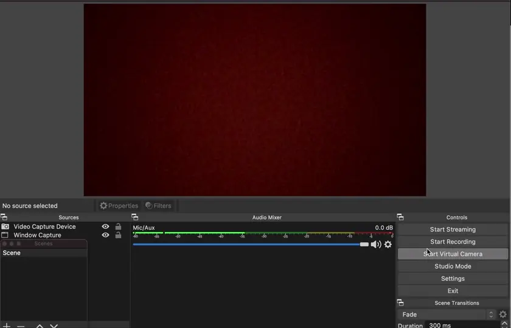

# RTMP to HLS

This demo is an application that is capable of receiving RTMP stream, converting it to HLS, and publishing via an HTTP server so that it can be played with a web player.

## Possible use cases

The application presented in this demo could be used in the following scenario.
There is one person, the so-called "streamer", and multiple "viewers", who want to see the stream of multimedia sent by the streamer.
The streamer sends multimedia using RTMP, a protocol supported by popular streaming software (i.e. OBS). Such an RTMP stream is then converted into HLS and published by the HTTP server, which is capable of handling many HTTP requests. The viewers can then play the multimedia delivered with HTTP. Such a solution scales well because the streamer doesn't have a direct connection with any of the viewers.

## Architecture of the solution

The system is divided into two parts:

- the server, is responsible for receiving the RTMP stream, converting it into HLS, and then publishing the created files with an HTTP server,
- the client, responsible for playing the incoming HLS stream.

### Server

The internal architecture of the server is presented below:


### Client

The client is just a simple javascript application using the [HLS.js](https://github.com/video-dev/hls.js/) web player.

## Prerequisites

In order to successfully build and install the plugin, you need to have ffmpeg 4.\* installed on your system.
Below there are some one-liner commands that will allow you to install that dependency on the desired OS.

### Ubuntu:

```
apt install ffmpeg
```

### MacOS:

```
brew install ffmpeg
```

Furthermore, make sure you have `Elixir` and `Erlang` installed on your machine. For installation details, see: https://elixir-lang.org/install.html

On Ubuntu, we recommend installation through asdf, see: https://asdf-vm.com/guide/getting-started.html

## Running the demo

To run the demo, clone the membrane_demo repository and checkout to the demo directory:

```
git clone https://github.com/membraneframework/membrane_demo
cd membrane_demo/rtmp_to_hls
```

Then you need to download the dependencies of the mix project:

```
mix deps.get
```

Then you may be asked to install `Hex` and then `rebar3`.

In case of installation issues with Hex on Ubuntu, try updating the system packages first by entering the command:

```shell
sudo apt-get update
```

In case of issue with compilation of membrane_h264_ffmpeg_plugin, enter:

```shell
mix deps.update bundlex
```

and then install pkg-config (MacOS):

```
brew install pkg-config
```

Finally, you can start the phoenix server:

```
mix phx.server
```

The server will be waiting for an RTMP stream on `localhost:9006`, and the client of the application will be available on `localhost:4000`.

### Exemplary stream generation with OBS

You can send RTMP stream onto `localhost:9006` with your favorite streaming tool. However, below we present how to generate an RTMP stream with
[OBS](https://obsproject.com).
Once you have OBS installed, you can perform the following steps:

1. Open the OBS application
2. Open the `Settings` windows
3. Go to the `Stream` tab and set the value in the `Server` field to: `rtmp://localhost:9006` (the address where the server is waiting for the stream)
4. Go to the `Output`, set output mode to `Advanced` and set `Keyframe Interval` to 2 seconds.
5. Finally, you can go back to the main window and start streaming with the `Start Streaming` button.

Below you can see how to set the appropriate settings (step 2) and 3) from the list of steps above):


## Copyright and License

Copyright 2018, [Software Mansion](https://swmansion.com/?utm_source=git&utm_medium=readme&utm_campaign=membrane)

[](https://swmansion.com/?utm_source=git&utm_medium=readme&utm_campaign=membrane)

Licensed under the [Apache License, Version 2.0](LICENSE)
